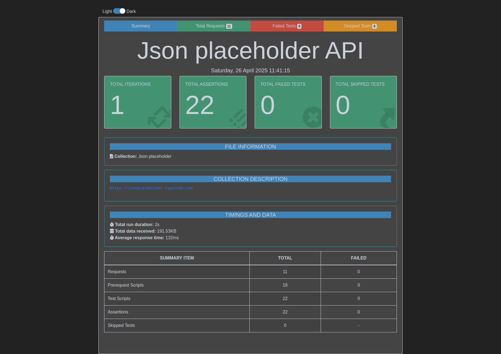
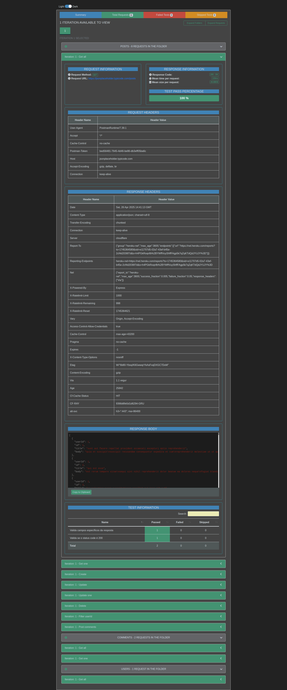

# Json placeholder API

Execução de testes api com a ferramenta **newman**

Exportação realizada do postman, foi incluído validações de status code e asserções do resultado dos campos da api

## Instalar

Necessário o node

```bash
npm i
```

## Executar

```bash
npm run test
```

## Relatório

O relatório é gerado na pasta newman da pasta root do projeto




## Usar o Jenkins com docker

- Instalar

```bash
docker-compose up -d
```

- Acessar url

```bash
http://localhost:8080/
```

- Obter senha do admin

```bash
docker exec -it jenkins cat /var/jenkins_home/secrets/initialAdminPassword
```

Lista de plugins necessários para o Jenkins

- NodeJS Plugin
- HTML Publisher

Pipeline

```bash
Jenkinsfile
```
